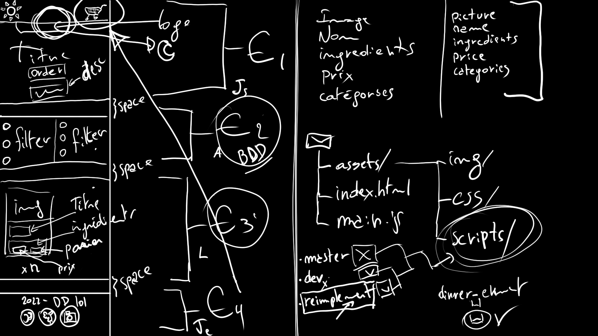

# <u>Takeawish</u>
## Dark kitchen

### Idée de départ du projet:

##### Objectif principal
- Créer un site en ligne ayant pour unique objectif un service livraison à domicile de différents menus.

##### Directives précises
- Ce doit être un site avec une page unique,
- Il doit y avoir une liste de plats à commander en ligne,
- Le site doit être responsive,
- Il faut présenter une liste d'ingrédients grâce à un modèle de cartes,
- Les ingrédients doivent être classé par catégorie de façon à pouvoir être filtré,
- Il faut qu'il existe un panier d'achat de manière à pouvoir montrer les plats sélectionnés et le montant total de la livraison,
- Il faut également retrouver sur cette page un commutateur de mode sombre pour pouvoir choisir entre un mode d'affichage clair et sombre.

Après avoir lu les instructions du travail (et 2 bonnes heures de débat), nous sommes arrivé à cette belle maquette de projet réalisée par Luca comme on peut le voir ci-dessus.

A partir de là, les tâches ont été réparties en 4 groupes principaux à savoir:
- le header,
- les filtres et la collection,
- le body principal avec les cartes,
- le footer avec le panier.

***Difficultés rencontrées:***
1. Appliquer correctement les filtres sur les menus;
2. Faire les liaisons entre les différents composants (menus/panier, filtres/menus, etc...);
3. Faire un design qui rend bien;
4. Implémenter le light/dark mode;
5. Les comportements de certaines balises en **CSS**.

Vous pouvez retrouver notre projet abouti à l'adresse ci-dessous: 
[Takeawish](https://friquetluca.github.io/dark-kitchen/)

### Travail réalisé par : 

- ***Luca Friquet***
- ***Axel Kirac***
- ***Julien Scourneau***
- ***Julien Elinckx***
